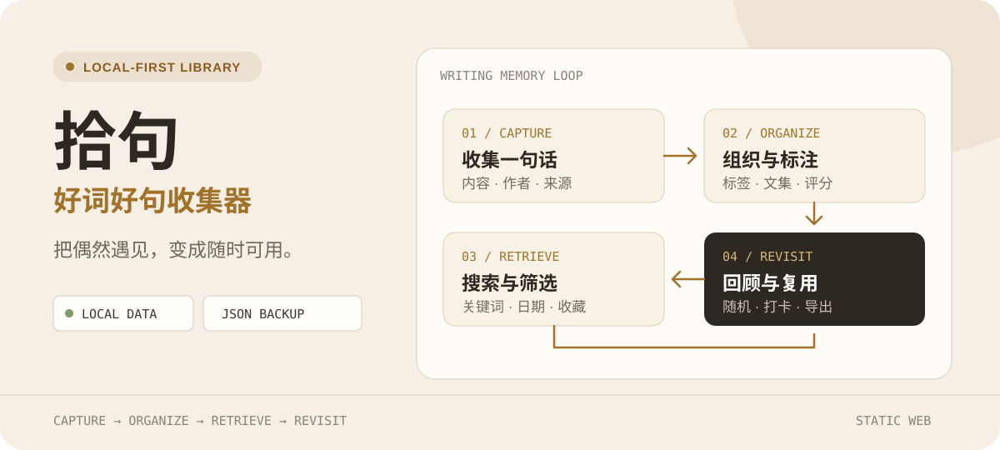
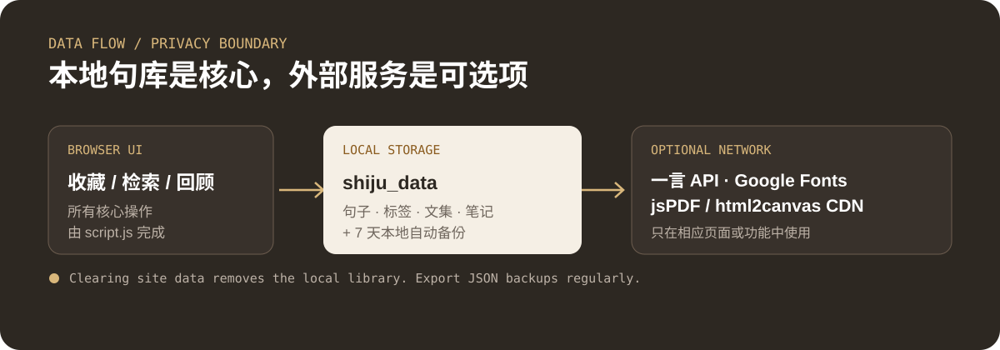

<p align="center">
  
</p>

<p align="center">
  <a href="https://shiju.userhali.com"><strong>在线使用</strong></a> ·
  <a href="#功能">功能</a> ·
  <a href="#数据与隐私">数据与隐私</a>
</p>

## 把遇见的好句，变成可再次调用的素材

拾句是一个面向学生、写作者和内容团队的中文句子管理工具。它把收藏、分类、检索、评分、笔记、文集与每日回顾集中在一个本地优先的网页应用中。

<p align="center">
  
</p>

## 功能

- 添加、编辑、删除句子，并记录作者或来源
- 标签、文集、评分、收藏与笔记
- 关键词搜索、精确匹配、日期和收藏筛选
- 按添加时间、作者或评分排序
- 随机一句、每日推荐与打卡回顾
- 批量选择、批量删除和导出
- JSON 导入/导出，便于迁移与备份
- PDF 导出与分享图片生成
- 阅读模式以及浅色、深色、跟随系统主题

## 立即使用

打开 **[shiju.userhali.com](https://shiju.userhali.com)**，点击“添加句子”，填写内容、作者和标签即可建立自己的句库。

项目是静态网页，也可以本地运行：

```bash
git clone https://github.com/haliChina/shiju.git
cd shiju
python3 -m http.server 8080
```

然后访问 `http://localhost:8080`。

## 数据与隐私

核心句库保存在当前浏览器的 `localStorage` 中，并按日期保留有限的本地自动备份。项目没有账户系统，也不会自动在设备之间同步数据。

> [!IMPORTANT]
> 清除浏览器站点数据、更换浏览器或设备会使本地句库不可用。请定期使用 JSON 导出功能保存独立备份。

部分可选功能会访问第三方服务：

- 在线随机句子可能请求一言 API
- PDF 导出会按需从 CDN 加载 `jsPDF` 与 `html2canvas`
- 页面字体由 Google Fonts 提供

因此，“本地优先”不等于“零网络请求”。不使用这些功能时，核心收藏和检索逻辑仍在浏览器中完成。

## 数据结构

句子记录主要包含：

```text
content · author · tags · rating · favorite · note · collection · createdAt
```

JSON 导入会跳过缺少必要字段或 ID 已存在的记录，便于合并备份。

## 项目结构

```text
shiju/
├── index.html        # 主应用
├── style.css         # 主题与响应式界面
├── script.js         # 数据、检索、导出与交互逻辑
├── legal/            # 条款与隐私页面
├── help.html
└── faq.html
```

## 部署

这是一个静态项目，可直接部署到 Vercel、Netlify、Cloudflare Pages 或任意静态服务器。仓库根目录不需要构建命令。

## License

当前仓库未包含明确的开源许可证文件。在复制、修改或再分发代码前，请先向维护者确认授权范围。
